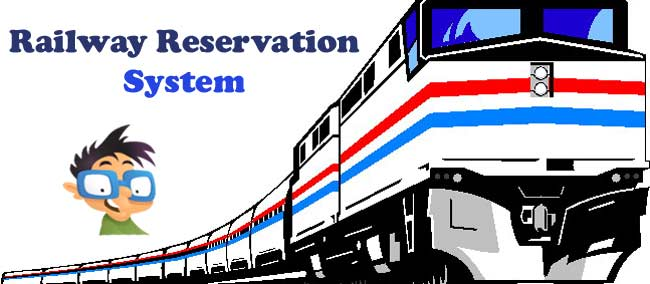

# Project Name: Railway Reservation System

# Description
* The system is about booking the tickets of user whose credentials gets accepted. User can login to system to check the Train details and booked tickets. User can also verify that his/her ticket is booked or not. Accordingly if the user wants to cancel the booked ticket they can do so.
 
## Folder Structure
Folder             | Description
-------------------| -----------------------------------------
`Architecture`         | Different UML Diagrams
`Report`         | Contains Version of Project and Release Date
`Requirements`   | Documents detailing requirements(high level and low level Requirements) and research
`Test_plan`      | Documents with test plans and procedures and outputs
`implementation` | Code Files required for project

# Badges
Contribution Check - Git Inspector :

Cppcheck-action :

Unit Testing :

C/C++ :

Code Coverage :

Valgrind_Check :

# Functions used for implementation
Function Used            | 
-------------------|
`Structures`       |
`User defined header Files`       |
`Pointers`       |
`Unity Framwork`       |

# Requirements for implementation
Requirements          | 
-------------------|
`MakeFile Configuration`       |
`Unity Framework`       |
`CppCheck`       |
`CodeCoverage`       |
`Valgrind`       |
`VS Code Extensions(C, C++ , Doxygen etc.)`       |
`Mingw-w64`       |

# Run Project
* Username:user
* password:pass
* In cmd/terminal at project implementation location
	* To Run Project
	* To Test Unit Testing(Ticket is booked or not)
		1. Run "make test"
	* To Check the code coverage
		1. Run "make coverage"
	* To delete all the executable files
		1. Run "make clean"

# Credit

SF Id. |  Name   |    Features    | Issuess Raised |Issues Resolved|No Test Cases|Test Case Pass
-------|---------|----------------|----------------|---------------|-------------|--------------
`264869` | Swati Tupat  | Feature A, B etc    | Y yes     | Y yes   |Y yes   |Y yes     

